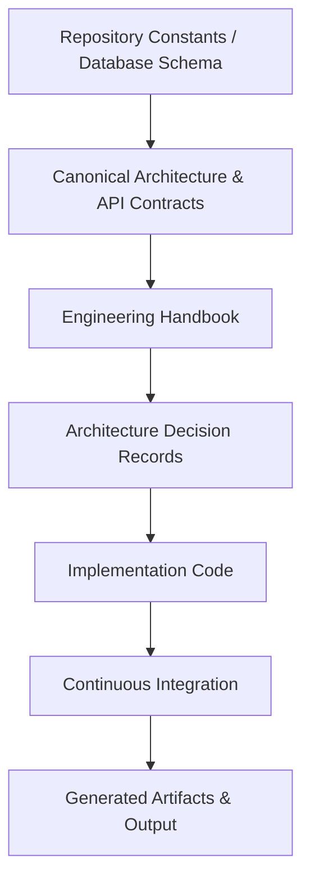

# NST Events Engineering Handbook

**Document ID**: ENG-000
**Version**: 1.0.0
**Status**: Frozen
**Authority Level**: Normative
**Document Type**: Guide
**Owner**: Engineering
**Supersedes**: None
**Last Reviewed**: 2026-08-08
**Next Review**: 2027-02-08
**Review Cadence**: 6 Months

## Purpose
This document serves as the entry point and primary map for the NST Events Engineering Handbook. It defines the documentation hierarchy, governance model, and provides a clear map of all canonical engineering standards.

## Scope
- Central navigation for all engineering documents.
- Documentation authority and precedence model.
- Governance structure for the engineering handbook.

## Out of Scope
- Implementation specifics (see [ENG-009](./08-tooling-contract.md)).
- Business logic or product requirements.
- External API contracts.

## References
- [ENG-010: Documentation Architecture](./09-documentation-architecture.md)
- [ENG-001: Glossary](./00-glossary.md)

## Version History
| Version | Date | Description |
|---------|------|-------------|
| 1.0.0 | 2026-08-08 | Initial creation of the Engineering Handbook. |

---

## Authority & Document Precedence

The Engineering Handbook dictates *how* engineering is performed. It sits strictly between the Canonical Architecture (which defines *what* is built) and the Implementation (the actual code). 

If a contradiction arises, the following precedence tree must be followed:

## Where to Begin

* **New Engineers**: Begin with the [Bootstrap Guide (ENG-012)](./11-bootstrap.md) to initialize your local environment, followed by [Engineering Standards (ENG-002)](./01-engineering-standards.md).
* **AI Agents**: Begin with the [AI Development Workflow (ENG-008)](./07-ai-development-workflow.md) and [Repository Invariants (ENG-011)](./10-repository-invariants.md) to ensure all immutable rules are followed before writing code.

## Document Map

### Core Governance
* [ENG-001: Glossary](./00-glossary.md)
* [ENG-010: Documentation Architecture](./09-documentation-architecture.md)
* [ENG-011: Repository Invariants](./10-repository-invariants.md)
* [ENG-017: Documentation Quality Standard](./16-documentation-quality-standard.md)

### Engineering Workflows
* [ENG-002: Engineering Standards](./01-engineering-standards.md)
* [ENG-003: Git Workflow](./02-git-workflow.md)
* [ENG-007: Release Process](./06-release-process.md)
* [ENG-008: AI Development Workflow](./07-ai-development-workflow.md)

### Quality & Automation
* [ENG-004: Quality Gates](./03-quality-gates.md)
* [ENG-005: CI/CD Architecture](./04-ci-cd-architecture.md)
* [ENG-006: Security Pipeline](./05-security-pipeline.md)

### Lifecycle & Maintenance
* [ENG-009: Tooling Contract](./08-tooling-contract.md)
* [ENG-012: Bootstrap Guide](./11-bootstrap.md)
* [ENG-013: Disaster Recovery](./12-disaster-recovery.md)
* [ENG-014: Dependency Management](./13-dependency-management.md)
* [ENG-015: Engineering Metrics](./14-engineering-metrics.md)
* [ENG-016: Maintenance Policy](./15-maintenance-policy.md)

## Governance Model
The Engineering Handbook is governed by the Principal Software Architect and the core engineering team. Any modifications to Normative documents or Repository Invariants require an Architecture Decision Record (ADR) and explicit consensus.
